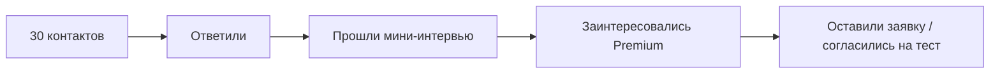

# 🎮 HobbySphere — Практическое занятие №22

> **Тема:** Конструирование и проверка модели монетизации.  
> **Формат:** README-style отчёт для защиты проекта.  
> **Проект:** мобильное приложение с AI‑персонажем, игровыми квестами, визуальным 3D‑миром и поиском напарников по хобби.

---

<p align="center">
  
  
  
  
</p>

---

## 📌 Краткое описание проекта

**HobbySphere** — мобильное приложение, которое помогает людям перестать откладывать любимые хобби «на потом».  
Пользователь пишет AI‑персонажу простую фразу вроде:

> «Хочу начать бегать, но одному скучно»  
> «Давно хочу играть на гитаре, но всё откладываю»  
> «Хочу рисовать, но не знаю, с чего начать»

AI‑персонаж превращает желание в **короткий игровой квест**, показывает прогресс в виде **3D мира‑шара**, выдаёт ачивки и помогает найти **напарника рядом**.

---

## 🧭 Цель практики

Сформировать модель монетизации для HobbySphere, разработать тарифы, спланировать sales test, построить упрощённую финансовую модель и определить, какие параметры сильнее всего влияют на жизнеспособность проекта.

---

## 🧩 1. Гипотезы монетизации

| № | Гипотеза | Кто платит | За что платит | Единица оплаты | Ориентир цены | Оценка |
|---|---|---|---|---|---:|---|
| H1 | **Freemium + Premium подписка** | Пользователь B2C | Больше квестов, ачивок, кастомизация мира, подбор напарников | Месяц доступа | 299–499 ₽/мес | ✅ Приоритетная |
| H2 | Микротранзакции | Активные пользователи | Скины, редкие предметы, ускорители прогресса | Разовая покупка | 99–499 ₽ | Средняя |
| H3 | Партнёрские офферы | Магазины хобби / бренды | Доступ к мотивированным пользователям | CPA / проморазмещение | 5–15% комиссии | Позже |
| H4 | B2B wellness-пакеты | Компании | Корпоративное вовлечение сотрудников в хобби и wellbeing | За сотрудника / месяц | 99–199 ₽/сотр. | Позже |

### ✅ Выбранная гипотеза для проверки

**H1: Freemium + Premium подписка.**

Почему она выбрана:

- ценность приложения проявляется регулярно, поэтому подписка логична;
- пользователь может попробовать продукт бесплатно и перейти в Premium после первой эмоциональной награды;
- модель хорошо подходит для мобильного B2C-продукта;
- Premium легко проверить через sales test: готов ли пользователь платить за расширенные AI‑квесты и социальные механики.

---

## 💎 2. Тарифы и оффер

### Тарифная сетка

| Тариф | Цена | Для кого | Что входит | Ограничения |
|---|---:|---|---|---|
| **Free** | 0 ₽ | Новички, которые только пробуют | 1 активное хобби, базовые AI‑квесты, 3 задания в день, базовый 3D‑мир, простые ачивки | Нет редких наград, ограниченный поиск напарников |
| **Premium** | 399 ₽/мес | Офисные работники и студенты, которым нужна мотивация | До 5 хобби, безлимитные AI‑квесты, расширенный 3D‑мир, редкие предметы, продвинутые ачивки, подбор напарников рядом | Индивидуальный тариф |
| **Duo / Friends** | 699 ₽/мес | Друзья или пары, которые хотят проходить квесты вместе | 2 Premium‑аккаунта, совместные квесты, общие ачивки, общий прогресс, мини‑соревнования | До 2 пользователей |

---

## 🧠 Почему цена оправдана

| Аргумент | Обоснование |
|---|---|
| 🎯 Экономия усилий | Пользователю не нужно самому придумывать план: AI превращает желание в микрозадания |
| 🎮 Эмоциональная награда | Игровой мир, ачивки и визуальный прогресс дают ощущение движения |
| 🤝 Социальная ценность | Подбор напарника снижает барьер «начинать одному скучно» |
| 🧩 Низкий чек | 399 ₽/мес сопоставимы с кофе/подпиской, но дают регулярную мотивацию |
| 📈 Масштабируемость | Один AI‑движок и квестовая логика применимы к разным хобби |

---

## 🚀 3. One-page sales offer

```text
HobbySphere — приложение, которое превращает отложенные хобби в игровые квесты.

Проблема:
Ты давно хочешь начать бегать, рисовать, играть на гитаре или заниматься другим хобби,
но постоянно откладываешь, потому что одному скучно и непонятно, с чего начать.

Решение:
AI‑персонаж даёт тебе первое микрозадание на 5 минут, показывает прогресс в 3D‑мире
и помогает найти напарника рядом.

Оффер:
Попробуй Premium на 7 дней бесплатно.
После пробного периода — 399 ₽/мес.

CTA:
Напиши своё хобби → получи первый квест → отметь выполнение → открой первую ачивку.
```

---

## ✉️ 4. Сообщение для первого контакта

```text
Привет! Я тестирую идею приложения HobbySphere.

Оно помогает начать хобби, которое давно откладываешь:
AI‑персонаж превращает желание в маленький квест, даёт ачивки
и помогает найти напарника по интересу.

Например: «хочу начать бегать, но одному скучно» →
приложение даст первое задание на 5 минут и предложит найти человека рядом.

Скажи, пожалуйста, было бы тебе интересно попробовать такой продукт?
И готов(а) ли ты платить 399 ₽/мес за Premium, если приложение реально помогает не бросать?
```

---

## 🎙️ 5. Скрипт уточняющих вопросов

| № | Вопрос | Что проверяем |
|---|---|---|
| 1 | Какое хобби ты давно хочешь начать, но откладываешь? | Наличие реальной боли |
| 2 | Почему ты до сих пор не начал(а)? | Главный барьер |
| 3 | Пользовался(лась) ли ты трекерами привычек? | Конкурентный опыт |
| 4 | Что тебе важнее: AI‑план, ачивки или напарник? | Ключевая ценность |
| 5 | Насколько идея 3D‑мира мотивирует возвращаться? | Сила геймификации |
| 6 | Заплатил(а) бы ты 399 ₽/мес за Premium? | Willingness to pay |
| 7 | Что должно быть в Premium, чтобы цена казалась честной? | Упаковка тарифа |
| 8 | Что бы заставило тебя удалить приложение? | Риски удержания |

---

## 🧪 6. План sales test

### Цель теста

Проверить, готов ли целевой сегмент платить за Premium‑подписку HobbySphere и какие элементы оффера воспринимаются как наиболее ценные.

---

### Портрет лидов

| Параметр | Описание |
|---|---|
| Возраст | 18–35 лет |
| Сегменты | Студенты, молодые специалисты, офисные работники |
| География | Крупные города |
| Поведение | Хочет начать хобби, но откладывает |
| Барьер | Лень, отсутствие компании, непонятный старт |
| Доход | Готовность платить за подписки 299–499 ₽/мес |

---

### Где взять 30 контактов

| Источник | Кол-во лидов | Почему подходит |
|---|---:|---|
| Telegram-чаты студентов | 8 | Много людей 18–25, открыты к новым приложениям |
| Личные контакты / друзья друзей | 7 | Можно быстро получить честную обратную связь |
| VK / Telegram сообщества по хобби | 8 | Есть интерес к хобби, но не всегда есть структура |
| Чаты офисных работников / коллег | 5 | Сегмент с деньгами и нехваткой времени |
| Комментарии под постами про прокрастинацию | 2 | Явная боль |

---

### Воронка sales test



---

### Метрики sales test

| Метрика | Формула | Целевое значение |
|---|---|---:|
| Reply Rate | Ответы / контакты | ≥ 40% |
| Interview Rate | Интервью / ответы | ≥ 60% |
| Interest Rate | Заинтересованы / интервью | ≥ 50% |
| WTP Signal | Готовы платить / интервью | ≥ 25% |
| Pilot Signup | Заявки на тест / контакты | ≥ 15% |

---

### Критерии успеха

Тест считается успешным, если из 30 контактов:

- не менее **12 человек ответили**;
- не менее **7 человек прошли мини-интервью**;
- не менее **4 человек сказали, что готовы попробовать Premium**;
- не менее **2–3 человек дали явный сигнал готовности платить**;
- чаще всего ценность называют не просто «трекер», а **AI‑квест + ачивки + напарник**.

---

## 📋 7. Форма фиксации результатов

| Лид | Сегмент | Хобби | Барьер | Ответил? | Интерес | Готовность платить | Комментарий |
|---|---|---|---|---|---|---|---|
| Lead 1 | Офисный работник | Бег | Одному скучно | Да | Высокий | 399 ₽/мес | Нужен напарник рядом |
| Lead 2 | Студент | Гитара | Нет плана | Да | Средний | 299 ₽/мес | Важны короткие задания |
| Lead 3 | Студент | Рисование | Лень | Нет | — | — | Не ответил |
| Lead 4 | Офисный работник | Спортзал | Нет времени | Да | Высокий | 399 ₽/мес | Нужны вечерние квесты |

---

## 💰 8. Финансовая модель на 6 месяцев

### Основные допущения

| Показатель | Значение | Основание |
|---|---:|---|
| Цена Premium | 399 ₽/мес | Допущение команды |
| Доля Premium | 8–14% | Ранний B2C freemium benchmark, учебное допущение |
| COGS | 20% от выручки | AI/API, серверы, поддержка |
| Маркетинг | 35 000–90 000 ₽/мес | Тестовые каналы и креативы |
| Разработка | 120 000 ₽/мес | MVP-команда / подряд |
| Операционные | 25 000–45 000 ₽/мес | Сервисы, дизайн, аналитика |

---

### Base scenario

| Месяц | Новые пользователи | Активные пользователи | Premium, % | Платящие | Выручка, ₽ | COGS, ₽ | Маркетинг, ₽ | Разработка, ₽ | Опер. расходы, ₽ | Опер. результат, ₽ |
|---:|---:|---:|---:|---:|---:|---:|---:|---:|---:|---:|
| 1 | 300 | 300 | 8% | 24 | 9 576 | 1 915 | 35 000 | 120 000 | 25 000 | -172 339 |
| 2 | 500 | 680 | 9% | 61 | 24 339 | 4 868 | 45 000 | 120 000 | 25 000 | -170 529 |
| 3 | 700 | 1 108 | 10% | 111 | 44 289 | 8 858 | 55 000 | 120 000 | 30 000 | -169 569 |
| 4 | 900 | 1 565 | 11% | 172 | 68 628 | 13 726 | 65 000 | 120 000 | 35 000 | -165 098 |
| 5 | 1 100 | 2 034 | 12% | 244 | 97 356 | 19 471 | 75 000 | 120 000 | 40 000 | -157 115 |
| 6 | 1 300 | 2 507 | 13% | 326 | 130 074 | 26 015 | 90 000 | 120 000 | 45 000 | -150 941 |

**Вывод:** в базовом сценарии проект пока не выходит в плюс, но демонстрирует рост платящих пользователей и снижение относительной убыточности. Для старта нужна инвестиционная runway или грант/акселератор.

---

## 📊 9. Сценарии и чувствительность

### Сравнение сценариев на 6-й месяц

| Сценарий | Активные пользователи | Premium, % | Платящие | ARPU, ₽ | Выручка, ₽ | Опер. результат, ₽ |
|---|---:|---:|---:|---:|---:|---:|
| Conservative | 1 600 | 7% | 112 | 299 | 33 488 | -198 210 |
| Base | 2 507 | 13% | 326 | 399 | 130 074 | -150 941 |
| Optimistic | 4 200 | 16% | 672 | 499 | 335 328 | 18 262 |

---

### Параметр 1: конверсия в Premium

| Конверсия | Платящие при 2 500 активных | Выручка при 399 ₽ | Вывод |
|---:|---:|---:|---|
| 7% | 175 | 69 825 ₽ | Недостаточно для покрытия затрат |
| 10% | 250 | 99 750 ₽ | Улучшает динамику, но всё ещё минус |
| 13% | 325 | 129 675 ₽ | Базовый ориентир |
| 16% | 400 | 159 600 ₽ | Требуется для приближения к устойчивости |

---

### Параметр 2: средний чек

| ARPU | Платящие | Выручка | Вывод |
|---:|---:|---:|---|
| 299 ₽ | 326 | 97 474 ₽ | Низкий чек ухудшает окупаемость |
| 399 ₽ | 326 | 130 074 ₽ | Базовая цена |
| 499 ₽ | 326 | 162 674 ₽ | Лучше для экономики, но нужно доказать ценность Premium |

---

### Параметр 3: количество активных пользователей

| Активные | Premium, % | Платящие | Выручка | Вывод |
|---:|---:|---:|---:|---|
| 1 500 | 13% | 195 | 77 805 ₽ | Мало масштаба |
| 2 500 | 13% | 325 | 129 675 ₽ | Базовый уровень |
| 4 000 | 13% | 520 | 207 480 ₽ | Значительно улучшает модель |
| 6 000 | 13% | 780 | 311 220 ₽ | Возможна операционная устойчивость при контроле затрат |

---

## 🧮 10. Unit economics

| Показатель | Значение | Комментарий |
|---|---:|---|
| ARPU Premium | 399 ₽/мес | Базовый тариф |
| Валовая маржа | 80% | После AI/API и инфраструктуры |
| Валовая прибыль с платящего | 319 ₽/мес | 399 × 80% |
| Предполагаемый churn Premium | 12%/мес | Риск раннего B2C-продукта |
| Средний срок жизни | 8,3 мес | 1 / churn |
| LTV | ≈ 2 648 ₽ | 319 × 8,3 |
| Целевой CAC | ≤ 800–900 ₽ | Чтобы payback был до 3 месяцев |

---

## ⚠️ 11. Самые рискованные допущения

| Риск | Почему опасен | Как проверяем |
|---|---|---|
| Пользователи не готовы платить | Могут воспринимать продукт как «просто трекер» | Sales test с WTP-вопросами |
| Слабое удержание | Пользователь может получить первую ачивку и уйти | D1/D7 retention, цепочки квестов |
| Высокий CAC | Игровое B2C-приложение может дорого привлекать | Тест органики, TikTok, рефералок |
| AI‑квесты не дают ценности | Если задания банальные, Premium не нужен | Интервью + тест первых сценариев |
| Социальная механика не работает при холодном старте | В регионе может не быть напарников | Сначала соло-квесты и асинхронные группы |

---

## ✅ 12. Выводы

### Что выглядит жизнеспособным

Приоритетная модель **Freemium + Premium** подходит проекту, потому что:

- бесплатный вход снижает барьер знакомства с приложением;
- Premium можно продавать через эмоциональную ценность: мир, ачивки, AI‑персонаж, напарники;
- подписка соответствует регулярному сценарию использования;
- продукт может масштабироваться на разные хобби без полной перестройки модели.

### Что нужно проверить первым

1. Готовы ли пользователи платить **399 ₽/мес**.
2. Что сильнее влияет на желание платить: **AI‑квесты**, **3D‑мир**, **ачивки** или **напарник**.
3. Достаточно ли первого задания, чтобы пользователь нажал **«Выполнил»**.
4. Возвращается ли пользователь на следующий день за новой наградой.
5. Можно ли привлекать пользователей дешевле **800–900 ₽ CAC**.

---

## 🗓️ 13. План следующего шага

| Неделя | Действие | Результат |
|---|---|---|
| 1 | Провести 30 контактов по sales test | Reply rate, WTP signal, причины отказов |
| 1 | Сделать простую оффер-страницу | Проверка CTA «Попробовать Premium» |
| 2 | Собрать 5–7 интервью | Понимание ценности Premium |
| 2 | Запустить прототип первого AI‑квеста | Проверка activation |
| 3 | Сравнить 2 цены: 299 и 399 ₽ | Чувствительность к цене |
| 4 | Обновить тарифы и финмодель | Подготовка к MVP / pre-seed |

---

## 🏁 Итог

> **HobbySphere может начинать проверку монетизации через Freemium + Premium подписку.**  
> Главный критерий жизнеспособности — не количество скачиваний, а готовность пользователя платить за регулярную мотивацию, AI‑квесты, визуальный прогресс и социальную поддержку.

---

## 📦 Артефакты практики

- ✅ 2–3 гипотезы монетизации  
- ✅ Приоритетная модель  
- ✅ Таблица тарифов  
- ✅ Sales offer  
- ✅ Сообщение первого контакта  
- ✅ Скрипт интервью  
- ✅ План sales test  
- ✅ Воронка и метрики  
- ✅ Финансовая модель на 6 месяцев  
- ✅ Анализ чувствительности  
- ✅ Выводы и следующий шаг  

---

<p align="center">
  <b>HobbySphere</b> — превращаем отложенные хобби в маленькие победы каждый день 🌍✨
</p>
